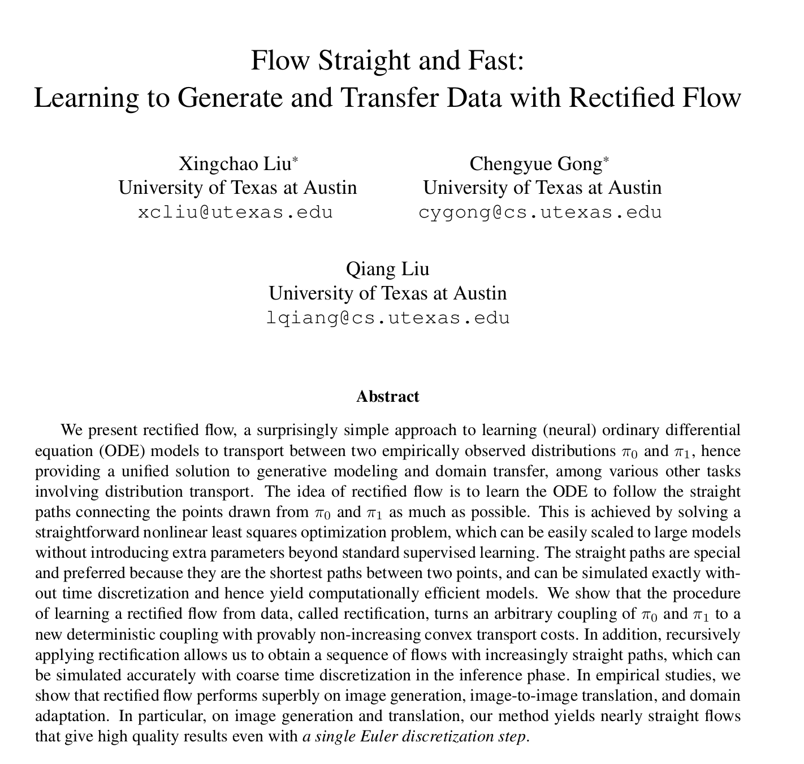

# Flow Straight and Fast: Rectified Flows in Python Unofficial LeetArxiv Implementation
[Rectified Flow models](https://leetarxiv.substack.com/p/rectified-flow-for-everyday-programmers) are a class of ODE solvers that learn to draw straight lines between noisy data and correct data.

Rectified flow models power Stable Diffusion 3 and we code the paper on [LeetArxiv](https://leetarxiv.substack.com/p/rectified-flow-for-everyday-programmers).

This is part of our _Diffusion Models From Scratch_ series:
1. [Diffusion Models and Noise Schedulers](https://leetarxiv.substack.com/p/stable-diffusion-from-scratch-1) 
2. [Text Diffusion Models From Scratch](https://leetarxiv.substack.com/p/discrete-diffusion-modelling-by-estimating) 
3. [SORA From Scratch: Diffusion Transformers for Video Generation Models](https://leetarxiv.substack.com/p/the-annotated-diffusion-transformer) 

## Getting Started
We provide a Jupyter Notebook written to be followed alongside this [LeetArxiv guide](https://leetarxiv.substack.com/p/rectified-flow-for-everyday-programmers).
